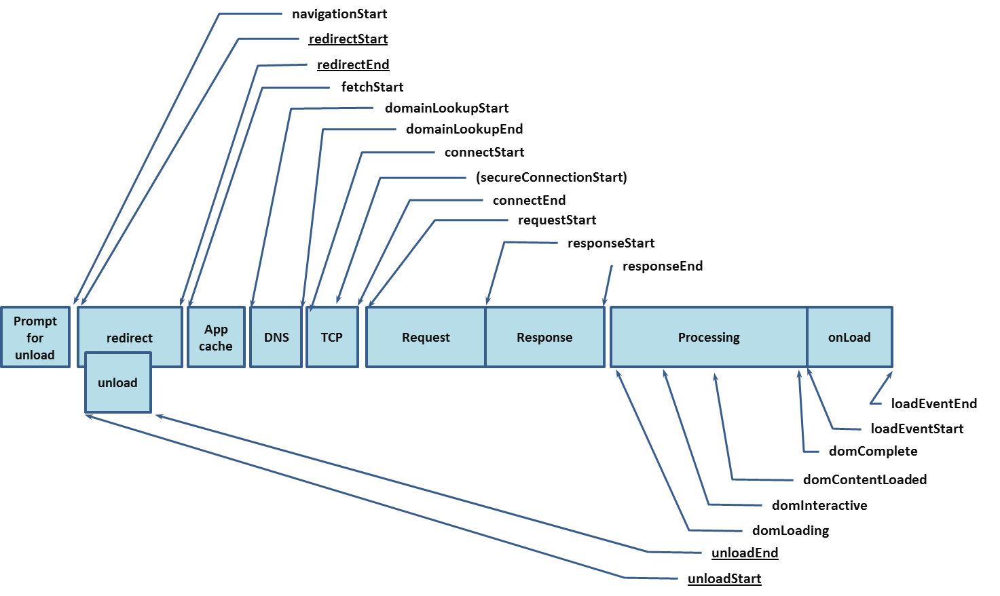

# 前端性能指标

## 传统的性能标准

传统性能指标主要依赖于 Navigation Timing 或者 Navigation Timing2，通过记录一个**文档从发起请求到加载完毕**，各阶段的性能耗时，以加载的速度来衡量性能。

### Navigation Timing



获取方法

```js
window.performance.timing
```


### Navigation Timing 2


获取方法

```js
window.performance.getEntriesByType('navigation')
```


## 以用户为中心的性能指标

| 用户体验   | 指标                                           |
| ---------- | ---------------------------------------------- |
| 发生了吗   | FP (First Paint), FCP (First Contentful Paint) |
| 内容有用吗 | FMP (First Meaningful Paint), SI (Speed Index) |
| 内容可用吗 | TTI(Time to Interactive)                       |
| 令人愉悦吗 | FID (First Input Delay)                        |

### FP & FCP

- FC (First Paint)：首次渲染的时间点。FP 时间点之前，用户看到的都是没有任何内容的白色屏幕
- FCP (First Contentful Paint)：首次有内容渲染的时间点。在用户访问 Web 网页的时候，FCP 时间点之前，用户看到的都是没有任何实际内容的屏幕。FCP 反映了当前 Web 页面的网络加载性能情况、页面的 DOM 结构复杂度情况、inline script 执行的效率等。当所有的阶段性能做的非常好的情况下，首次出现内容的时间就会越短，用户等待的时间就会越短，流失率就会越低。

### FMP & SI

- FMP (First Meaningful Paint)：首次绘制有意义内容的时间点。当整体页面的布局和文字内容全部渲染完成之后，可以认为是完成了首次有意义内容的绘制。FMP 通常被认为是用户获取到了页面主要信息的时刻，也就是说此时用户的需求是得到了满足的。

前端业界现在比较认可的计算 FMP 的方式为**页面在加载和渲染过程中最大布局变动之后的那个绘制时间**。

FMP 的实现原理：

理论依据：认为 **DOM 结构变化的时间点与之对应的渲染时间点近似相同**。所以 **FMP 的时间点为 DOM 结构变化最剧烈的时间点**。DOM 结构变化的时间点可以通过 [MutationObserver API](https://developer.mozilla.org/zh-CN/docs/Web/API/MutationObserver) 获取。

计算步骤：

1. 通过 Mutation Observer 监听每一次页面整体的 DOM 变化，触发 Mutation Observer 的回调
2. 在回调计算出当前 DOM 树的分数，分数变化最剧烈的时刻就是 FMP 的时间点

- SI (Speed Index)：衡量页面可视区域加载速度，帮助检测页面的加载体验差异。（这一步测试的步骤较为复杂繁琐，所以一般只将其用于实验环境中而不是线上监控）

### TTI

- TTI (Time to Interactive)：测量页面从加载到主要子资源完成渲染，并能够快速、可靠地响应用户输入所需的时间。

TTI 越小，代表用户可以越早操作页面，用户体验就越好。

TTI 实现原理：

- 首先进行首次内容绘制，即 FCP
- 沿着时间轴正向搜索时长至少为 5s 的安静窗口。其中安静窗口表示的是没有长任务且不超过两个正在处理的 GET 网络请求。
- 沿着时间轴反向搜索安静窗口之前的最后一个长任务，如果没有找到长任务，就在 FCP 步骤停止执行
- TTI 是安静窗口之前的最后一个长任务的结束时间。若没有长任务，TTI 的值就等同于 FCP 的值

### FID

- FID (First Input Delay)：测量用户第一次与页面交互（比如点击链接、点击按钮等）直到浏览器对交互做出响应，实际能够处理事件所经过的时间

FID 的重要性：

- FID 能够反映用户对页面交互性和响应性的第一印象，良好的第一印象有助于用户建立对整个应用的良好印象
- 页面加载阶段，资源的处理任务最重，也最容易产生延迟。因此关注 FID 指标对于提示页面的可交互性有很大的收益
- FID 和页面加载完成后的 Input Delay 具有不同的解决方案。针对 FID，一般建议通过 Code Splitting 等方式减少页面加载阶段 JS 的加载、解析和执行时间。而页面加载完成之后的 Input Delay，通常是由于开发人员代码编写不当、引起 JS 执行时间过长而产生的

## 全新指标

### LCP

- LCP (Largest Contentful Paint)：最大的内容在可视区域内变得可见的时间点。（LCP 非常近似于 FMP，同时计算 FMP 的性能消耗较大，会因为细小的变化导致剧烈波动，所以 **FMP 逐渐通过 LCP 替代了**）
- 与 FMP 相比，LCP 容易理解、且容易计算和上报、可以给出与 FMP 相似的结果

### TBP

- TBT (Time Blocking Time)：量化主线程在空闲之前的繁忙程度，有助于理解在加载期间，页面无法响应用户输入的时间有多久。

长任务：如果一个任务在主线程超过 50ms，那么它就是长任务。超过 50ms 后的任务耗时，都算作任务的阻塞时间。**一个页面的 TBT，是从 FCP 到 TTI 之间所有长任务的阻塞时间的总和**。

### CLS

- CLS (Cumulative Layout Shift)：累积布局偏移量。量化了在页面加载期间，视口中元素的移动程度。

无论是在点击的时候加载广告，还是在加载图片的时候出现了文本的向下移动，内容的意外移动（也即是抖动）都会让人感到非常不舒服。

CLS 分数越低越好，因为意味着在整个页面交互过程之中发生偏移的内容较少。

## 性能标准

### 阈值

没有完美的阈值，通常选择样本量的第 75% 个百分点来设置阈值，基于两个标准：

- 对页面的大多数访问都达到了目标的性能水平
- 不受到异常值的过度影响

### 性能标准


为什么没有 FMP、TBT 和 SI？

- LCP 近似于 FMP，所以可以用 LCP 代替 FMP
- SI 计算逻辑较为复杂，通常用在 lighthouse 而不是线上监控
- 虽然 TBT 可以在线上进行测量，但是不建议这样做，因为用户交互会影响网页的 TBT，导致报告出现一些异常。所以推荐线上监控使用 FID

## 如何获取性能指标

- web-vitals：npm 包 / Chrome 插件
- 本地查看：devtools / lighthouse（只能本地使用）
- 接入前端监控：如火山引擎
